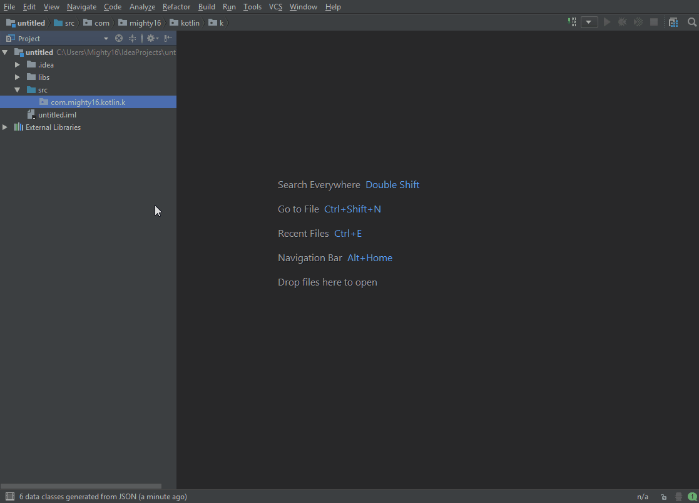

# JSONToKotlinClass
Intellij Idea, Android Studio plugin.

Plugin generates Kotlin data classes from JSON text. It can find inner classes in nested JSON. You can disable undesirable fields in class, change field name, set it type to optional, specify default value and add annotations for popular json libraries. 

Features: 

• json highlight and validation 
• nested json parsing 
• var/val support 
• default value support 
• generation to single file 
• annotations for Gson, Moshi, Jackson 

# Download

You can install it from <a href="https://plugins.jetbrains.com/plugin/10054">plugin repository</a>

# How to use
Right click on package -> Generate class from JSON -> Copy json, type class name -> Check field names and types -> Generate

# License
MIT License

Copyright (c) 2017 Mighty16

