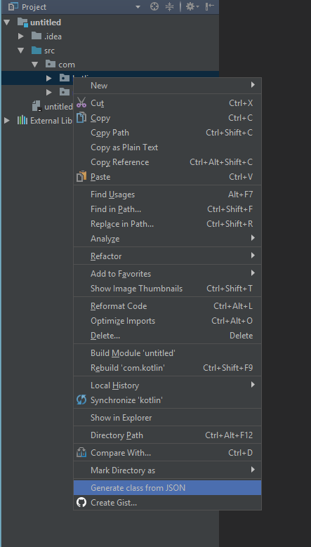
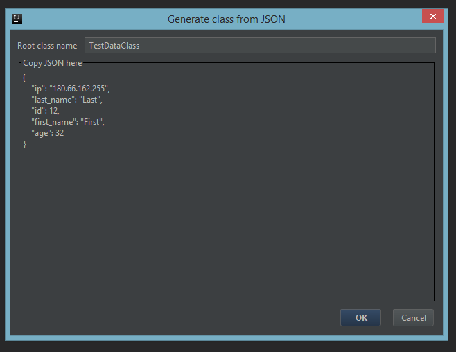

# JSONToKotlinClass
Intellij Idea, Android Studio plugin.

Plugin generates Kotlin data classes from JSON text. It can find inner classes in nested JSON. You can disable undesirable fields in class, change field name and type and add Gson annotations.

# Download

You can install it from <a href="https://plugins.jetbrains.com/plugin/10054">plugin repository</a>

# How to use
Right click on package -> Generate class from JSON -> Copy json, type class name -> Check field names and types -> Generate

